# TrueSpend PostgreSQL Database Schema & Architecture

This document provides a comprehensive, field-by-field technical specification of the TrueSpend database schema, architecture, relationships, constraints, domain invariants, and operational workflows.

---

## 1. Architectural Overview & Technology Stack

The TrueSpend persistence tier is built on PostgreSQL, chosen for strict ACID guarantees, atomic multi-table transactions, rich relational integrity, and native support for custom enumerations and JSON.

```
┌────────────────────────────────────────────────────────────────────────┐
│                          APPLICATION TIER                              │
│                                                                        │
│   Express.js API Controllers  ◄───►  Domain Services / Repositories   │
│   (Transaction, Debt, Settings, KPI, Push, Goal, CategoryBudget)       │
└───────────────────────────────────┬────────────────────────────────────┘
                                    │
                                    │ Drizzle ORM (Node-Postgres Driver)
                                    ▼
┌────────────────────────────────────────────────────────────────────────┐
│                        CONNECTION POOL TIER                            │
│                                                                        │
│   Node-Postgres (pg.Pool) Singleton (`global._postgresPool`)           │
│   - Connection Strings: `POSTGRES_URL`, `DATABASE_URL` (Neon / AWS)    │
│   - Max Concurrent Connections: 10                                     │
│   - Connection Timeout: 15,000 ms                                      │
│   - Idle Client Error Catching & Dynamic Schema Auto-Migration         │
└───────────────────────────────────┬────────────────────────────────────┘
                                    │ TCP / TLS (sslmode=require)
                                    ▼
┌────────────────────────────────────────────────────────────────────────┐
│                        POSTGRESQL DATABASE                             │
│                                                                        │
│   - Extensions: `pgcrypto` (gen_random_uuid)                           │
│   - Custom ENUMs: transaction_type, wallet_type, debt_type, debt_status│
│   - 10 Relational Tables with Foreign Key Constraints & Cascades       │
│   - Full SQL Dump & Restore Engine + Google Drive Backup Schedulers    │
└────────────────────────────────────────────────────────────────────────┘
```

### Core Technologies
- **Engine**: PostgreSQL 15+ (Hosted on Neon / Cloud SQL)
- **Data Access Layer**: [Drizzle ORM](https://orm.drizzle.team/) with `@neondb/serverless` / `pg` node driver
- **Connection Pooling**: Native `pg.Pool` configured with connection reuse, error recovery, and connection timeout thresholds
- **Identifier Strategy**: Universally Unique Identifiers (`UUID v4`) generated at database level using `pgcrypto.gen_random_uuid()`
- **Precision Currency Format**: `DECIMAL` / `NUMERIC` used for all monetary amounts to completely eliminate IEEE 754 floating-point rounding errors

---

## 2. PostgreSQL Custom ENUM Types

TrueSpend leverages custom PostgreSQL types to enforce strict state and classification validation directly at the database engine level:

```sql
CREATE TYPE transaction_type AS ENUM ('Income', 'Expense', 'Transfer', 'Debt Repayment');
CREATE TYPE wallet_type AS ENUM ('Bank', 'Cash');
CREATE TYPE debt_type AS ENUM ('Receivable', 'Payable');
CREATE TYPE debt_status AS ENUM ('Pending', 'Cleared');
```

| Type Name | Allowed Values | Domain Role |
| :--- | :--- | :--- |
| `transaction_type` | `'Income'`, `'Expense'`, `'Transfer'`, `'Debt Repayment'` | Dictates how the transaction influences cash flow, liquidity balances, and budget calculations. |
| `wallet_type` | `'Bank'`, `'Cash'` | Specifies the storage vehicle / liquidity account where the funds reside. |
| `debt_type` | `'Receivable'`, `'Payable'` | Identifies whether money is owed to the user (`Receivable`) or by the user (`Payable`). |
| `debt_status` | `'Pending'`, `'Cleared'` | Indicates if the counterparty obligation is still open or fully settled. |

---

## 3. Entity Relationship Diagram (ERD)

```mermaid
erDiagram
    users ||--o{ transactions : "owns"
    users ||--o{ debts : "tracks"
    users ||--o{ payrolls : "schedules"
    users ||--o{ category_budgets : "allocates"
    users ||--o{ goals : "targets"
    users ||--o{ push_subscriptions : "registers"
    users ||--o| notification_preferences : "configures"
    users ||--o{ notification_deliveries : "logs"
    users ||--o{ notification_devices : "legacy_devices"

    transactions ||--o| splits : "can be split"
    transactions }o--o| payrolls : "originates from"
    debts ||--o{ splits : "linked counterparty"

    users {
        uuid id PK
        text uid UK "Firebase Auth UID"
        text email
        timestamp created_at
        integer payday "Default: 25"
        decimal emergency_buffer "Default: 0"
        decimal salary "Default: 0"
        integer automated_drive_backups "0 or 1"
        timestamp last_drive_backup_date
        text drive_backup_frequency "'daily'|'3days'|'weekly'"
        text google_drive_token
        timestamp google_drive_token_expiry
        integer notification_enabled
        text notification_time
    }

    transactions {
        uuid id PK
        uuid user_id FK
        timestamp created_at
        decimal amount "Monetary value"
        transaction_type type "Income | Expense | Transfer | Debt Repayment"
        wallet_type source_wallet "Bank | Cash"
        text category "Canonical Category"
        text notes "Merchant / memo"
        uuid payroll_id FK "Nullable calendar reference"
    }

    debts {
        uuid id PK
        uuid user_id FK
        text contact_name "Counterparty name"
        debt_type type "Receivable | Payable"
        decimal original_amount
        decimal remaining_balance
        debt_status status "Pending | Cleared"
        timestamp due_date
        timestamp created_at
    }

    splits {
        uuid id PK
        uuid transaction_id FK
        decimal reimbursable_amount
        uuid linked_contact_id FK "Nullable debt reference"
    }

    payrolls {
        uuid id PK
        uuid user_id FK
        timestamp scheduled_for "Salary date"
        decimal amount "Expected net salary"
        timestamp created_at
    }

    category_budgets {
        uuid id PK
        uuid user_id FK
        text category "Category name"
        integer year "e.g. 2026"
        integer month "1 to 12"
        decimal amount "Budget limit"
        timestamp created_at
        timestamp updated_at
    }

    goals {
        uuid id PK
        uuid user_id FK
        text name "Milestone title"
        decimal target_amount
        decimal current_amount "Accrued savings"
        timestamp deadline
        text category
        text notes
        timestamp created_at
        timestamp updated_at
    }

    push_subscriptions {
        uuid id PK
        uuid user_id FK
        text endpoint UK "Browser push endpoint"
        text p256dh "Public key"
        text auth "Auth secret"
        text user_agent
        timestamp created_at
        timestamp updated_at
    }

    notification_preferences {
        uuid id PK
        uuid user_id FK, UK "1:1 with user"
        boolean enabled
        boolean daily_insight_enabled
        boolean budget_warning_enabled
        boolean forecast_warning_enabled
        boolean debt_reminder_enabled
        boolean anomaly_enabled
        boolean goal_enabled
        text delivery_time "e.g. '09:00'"
        text timezone "Default: 'Africa/Casablanca'"
        text quiet_hours_start "e.g. '22:00'"
        text quiet_hours_end "e.g. '07:00'"
    }

    notification_deliveries {
        uuid id PK
        uuid user_id FK
        text type "DAILY_INSIGHT, etc."
        text scheduled_for "YYYY-MM-DD"
        timestamp delivered_at
        text status "'sent' | 'failed'"
        text metadata "JSON string"
    }
```



---

## 4. Comprehensive Table Specifications

### 4.1. `users` (Identity, Financial Cycle & Cloud Backup Settings)
The master entity representing authenticated TrueSpend accounts. It anchors all financial records and stores user-level financial configurations.

| Column | PostgreSQL Type | Nullable | Default | Constraints / Description |
| :--- | :--- | :---: | :--- | :--- |
| `id` | `uuid` | **No** | `gen_random_uuid()` | **PRIMARY KEY**. Internal database reference. |
| `uid` | `text` | **No** | *None* | **UNIQUE**. External Firebase Authentication User ID. |
| `email` | `text` | **No** | *None* | User's primary email address. |
| `created_at` | `timestamp` | Yes | `NOW()` | Registration timestamp. |
| `payday` | `integer` | Yes | `25` | Day of the month (1–31) on which the user's financial month resets. |
| `emergency_buffer` | `decimal` | **No** | `'0'` | Minimum reserve balance excluded from "Safe to Spend" liquidity. |
| `salary` | `decimal` | **No** | `'0'` | Default monthly net salary used for baseline KPI forecasting. |
| `automated_drive_backups` | `integer` | Yes | `0` | Boolean flag (`1` = enabled, `0` = disabled) for automated cloud backups. |
| `last_drive_backup_date` | `timestamp` | Yes | `NULL` | Timestamp of the most recent successful Google Drive backup. |
| `drive_backup_frequency` | `text` | Yes | `'weekly'` | Cloud backup interval: `'daily'`, `'3days'`, or `'weekly'`. |
| `google_drive_token` | `text` | Yes | `NULL` | OAuth access token used by server-side cron to upload backups. |
| `google_drive_token_expiry`| `timestamp` | Yes | `NULL` | Token expiration timestamp. |
| `notification_enabled` | `integer` | Yes | `0` | Global notification master toggle. |
| `notification_time` | `text` | Yes | `'09:00'` | Preferred delivery time in HH:mm format. |

#### Domain Rules:
- When calculating monthly KPIs, the user's current financial month runs from day `payday` of the prior month up to `payday - 1` of the current month (or configured calendar payrolls).
- The `emergency_buffer` is actively subtracted in the liquidity engine:
  $$\text{Spendable Liquidity} = \text{Bank Balance} + \text{Cash on Hand} - \text{Emergency Buffer}$$

---

### 4.2. `transactions` (Core Financial Ledger)
The immutable ledger capturing every financial event that moves money into, out of, or between wallets.

| Column | PostgreSQL Type | Nullable | Default | Constraints / Description |
| :--- | :--- | :---: | :--- | :--- |
| `id` | `uuid` | **No** | `gen_random_uuid()` | **PRIMARY KEY**. Transaction identifier. |
| `user_id` | `uuid` | **No** | *None* | **FOREIGN KEY** $\rightarrow$ `users(id)`. Owning user. |
| `created_at` | `timestamp` | Yes | `NOW()` | Effective date and time of the transaction. |
| `amount` | `decimal` | **No** | *None* | Transaction monetary magnitude (strictly positive decimal). |
| `type` | `transaction_type` | **No** | *None* | Enum: `'Income'`, `'Expense'`, `'Transfer'`, `'Debt Repayment'`. |
| `source_wallet` | `wallet_type` | **No** | *None* | Enum: `'Bank'` or `'Cash'`. |
| `category` | `text` | Yes | `NULL` | Canonical category name (e.g. `'🛒 Groceries'`). |
| `notes` | `text` | Yes | `NULL` | Free-text merchant description, memo, or receipt reference. |
| `payroll_id` | `uuid` | Yes | `NULL` | **FOREIGN KEY** $\rightarrow$ `payrolls(id)`. Populated if created from calendar income. |

#### Ledger Mathematics:
- **Income**: Increases `source_wallet` balance. Included in period revenue.
- **Expense**: Decreases `source_wallet` balance. Counted against category budgets.
- **Transfer**: Moves funds between wallets. Net cash flow impact is $0.
- **Debt Repayment**: Increases or decreases liquidity depending on whether repaying a payable or collecting a receivable.

---

### 4.3. `debts` (Counterparty Obligations & Credit Ledger)
Tracks money borrowed from or lent to third parties (friends, family, institutions).

| Column | PostgreSQL Type | Nullable | Default | Constraints / Description |
| :--- | :--- | :---: | :--- | :--- |
| `id` | `uuid` | **No** | `gen_random_uuid()` | **PRIMARY KEY**. Debt record identifier. |
| `user_id` | `uuid` | **No** | *None* | **FOREIGN KEY** $\rightarrow$ `users(id)`. |
| `contact_name` | `text` | **No** | *None* | Name of the borrower or lender. |
| `type` | `debt_type` | **No** | *None* | Enum: `'Receivable'` (they owe me) or `'Payable'` (I owe them). |
| `original_amount` | `decimal` | **No** | *None* | Initial principal value of the obligation. |
| `remaining_balance`| `decimal` | **No** | *None* | Unpaid remaining balance. |
| `status` | `debt_status` | **No** | *None* | Enum: `'Pending'` or `'Cleared'`. |
| `due_date` | `timestamp` | Yes | `NULL` | Optional expected date of complete repayment. |
| `created_at` | `timestamp` | Yes | `NOW()` | Timestamp when debt was initiated. |

#### Lifecycle & State Invariants:
- A new debt begins with `remaining_balance = original_amount` and `status = 'Pending'`.
- When a settlement or partial payment is made:
  $$\text{remaining\_balance}_{\text{new}} = \text{remaining\_balance}_{\text{old}} - \text{payment\_amount}$$
- If $\text{remaining\_balance} \le 0$, `status` automatically flips to `'Cleared'`.
- Creating or settling a debt optionally produces a paired entry in `transactions` with type `'Debt Repayment'`.

---

### 4.4. `splits` (Shared Expense Allocations)
Enables splitting a single large transaction among multiple parties, linking reimbursable amounts directly to debts.

| Column | PostgreSQL Type | Nullable | Default | Constraints / Description |
| :--- | :--- | :---: | :--- | :--- |
| `id` | `uuid` | **No** | `gen_random_uuid()` | **PRIMARY KEY**. Split record identifier. |
| `transaction_id` | `uuid` | **No** | *None* | **FOREIGN KEY** $\rightarrow$ `transactions(id)`. |
| `reimbursable_amount`| `decimal`| **No** | *None* | Amount that is owed back by the other party. |
| `linked_contact_id`| `uuid` | Yes | `NULL` | **FOREIGN KEY** $\rightarrow$ `debts(id)`. Optional link to a debt record. |

#### Financial Engine Impact:
- When calculating net category expense:
  $$\text{Net Expense} = \text{Transaction Amount} - \text{Reimbursable Amount}$$
- The user's actual personal burn rate only reflects their own share of the bill.

---

### 4.5. `payrolls` (Financial Calendar & Income Schedule)
Allows users to define custom pay dates and expected net salaries that override or supplement default monthly cycles.

| Column | PostgreSQL Type | Nullable | Default | Constraints / Description |
| :--- | :--- | :---: | :--- | :--- |
| `id` | `uuid` | **No** | `gen_random_uuid()` | **PRIMARY KEY**. |
| `user_id` | `uuid` | **No** | *None* | **FOREIGN KEY** $\rightarrow$ `users(id)`. |
| `scheduled_for` | `timestamp` | **No** | *None* | Exact date when payroll funds become available. |
| `amount` | `decimal` | **No** | *None* | Net salary amount expected on that date. |
| `createdAt` | `timestamp` | **No** | `NOW()` | Creation timestamp. |

#### Relationship to Transactions:
- When a scheduled payroll matures or is marked received, the system generates an `Income` transaction with `payroll_id` referencing this record.

---

### 4.6. `category_budgets` (Monthly Category Spending Limits)
Stores budgeted monthly spending allowances per category, allowing historical comparison and monthly trend tracking.

| Column | PostgreSQL Type | Nullable | Default | Constraints / Description |
| :--- | :--- | :---: | :--- | :--- |
| `id` | `uuid` | **No** | `gen_random_uuid()` | **PRIMARY KEY**. |
| `user_id` | `uuid` | **No** | *None* | **FOREIGN KEY** $\rightarrow$ `users(id)`. |
| `category` | `text` | **No** | *None* | Standardized canonical category name. |
| `year` | `integer` | **No** | *None* | Calendar year (e.g. `2026`). |
| `month` | `integer` | **No** | *None* | Calendar month integer (`1` = January, `12` = December). |
| `amount` | `decimal` | **No** | *None* | Monthly spending ceiling in MAD. |
| `created_at` | `timestamp` | **No** | `NOW()` | Record created. |
| `updated_at` | `timestamp` | **No** | `NOW()` | Last modified timestamp. |

#### Unique Index Constraint:
```sql
CONSTRAINT category_budgets_user_category_month_unique 
UNIQUE (user_id, category, year, month)
```
- Guarantees that a user can have at most **one** budget limit per category per month. Updates execute via atomic upsert (`INSERT ... ON CONFLICT DO UPDATE`).

---

### 4.7. `goals` (Savings Milestones & Target Funds)
Stores financial aspirations (e.g. Emergency Fund, Car Down Payment, Vacation, Tech Gear).

| Column | PostgreSQL Type | Nullable | Default | Constraints / Description |
| :--- | :--- | :---: | :--- | :--- |
| `id` | `uuid` | **No** | `gen_random_uuid()` | **PRIMARY KEY**. |
| `user_id` | `uuid` | **No** | *None* | **FOREIGN KEY** $\rightarrow$ `users(id)`. |
| `name` | `text` | **No** | *None* | Title of the savings target. |
| `target_amount` | `decimal` | **No** | *None* | Total sum needed to achieve the goal. |
| `current_amount`| `decimal` | **No** | `'0'` | Currently accrued funds allocated to this goal. |
| `deadline` | `timestamp` | Yes | `NULL` | Target completion date. |
| `category` | `text` | **No** | `''` | Goal classification tag. |
| `notes` | `text` | **No** | `''` | Goal strategy, links, or notes. |
| `created_at` | `timestamp` | **No** | `NOW()` | Creation timestamp. |
| `updated_at` | `timestamp` | **No** | `NOW()` | Last modified timestamp. |

#### Computed Metrics:
- **Progress Ratio**: $\frac{\text{current\_amount}}{\text{target\_amount}} \times 100\%$
- **Required Monthly Contribution**: $\frac{\text{target\_amount} - \text{current\_amount}}{\text{Remaining Months Until Deadline}}$

---

### 4.8. `push_subscriptions` (Web Push VAPID Device Endpoints)
Stores modern Web Push API subscriptions for client browsers and PWAs.

| Column | PostgreSQL Type | Nullable | Default | Constraints / Description |
| :--- | :--- | :---: | :--- | :--- |
| `id` | `uuid` | **No** | `gen_random_uuid()` | **PRIMARY KEY**. |
| `user_id` | `uuid` | **No** | *None* | **FOREIGN KEY** $\rightarrow$ `users(id)`. |
| `endpoint` | `text` | **No** | *None* | **UNIQUE**. Browser vendor push service URL. |
| `p256dh` | `text` | **No** | *None* | Cryptographic ECDH public key (base64url). |
| `auth` | `text` | **No** | *None* | Authentication secret (base64url). |
| `user_agent` | `text` | Yes | `NULL` | Browser platform identifier. |
| `created_at` | `timestamp` | **No** | `NOW()` | Timestamp created. |
| `updated_at` | `timestamp` | **No** | `NOW()` | Timestamp updated. |

---

### 4.9. `notification_preferences` (Notification Engine v2 Rules)
Configures which automated alerts a user receives, their delivery schedule, and quiet hours.

| Column | PostgreSQL Type | Nullable | Default | Constraints / Description |
| :--- | :--- | :---: | :--- | :--- |
| `id` | `uuid` | **No** | `gen_random_uuid()` | **PRIMARY KEY**. |
| `user_id` | `uuid` | **No** | *None* | **FOREIGN KEY** $\rightarrow$ `users(id)`, **UNIQUE** (1:1 with user). |
| `enabled` | `boolean` | **No** | `false` | Master toggle for push alerts. |
| `daily_insight_enabled` | `boolean` | **No** | `true` | Daily "Safe to Spend" briefing. |
| `budget_warning_enabled`| `boolean` | **No** | `true` | Alert when category spend trends above average. |
| `forecast_warning_enabled`| `boolean`| **No** | `true` | Alert when end-of-period balance projects deficit. |
| `debt_reminder_enabled` | `boolean` | **No** | `true` | Overdue and upcoming debt repayment notifications. |
| `anomaly_enabled` | `boolean` | **No** | `true` | Unusual transaction spike warnings. |
| `goal_enabled` | `boolean` | **No** | `true` | Goal milestone progress updates. |
| `delivery_time` | `text` | **No** | `'09:00'` | Local scheduled delivery time in `HH:mm`. |
| `timezone` | `text` | **No** | `'Africa/Casablanca'`| IANA timezone used for delivery calculation. |
| `quiet_hours_start` | `text` | **No** | `'22:00'` | Start of quiet hours (notifications suppressed). |
| `quiet_hours_end` | `text` | **No** | `'07:00'` | End of quiet hours. |

---

### 4.10. `notification_deliveries` (Idempotency & Audit Log)
Guarantees that recurring scheduled jobs never spam users with duplicate alerts on the same day.

| Column | PostgreSQL Type | Nullable | Default | Constraints / Description |
| :--- | :--- | :---: | :--- | :--- |
| `id` | `uuid` | **No** | `gen_random_uuid()` | **PRIMARY KEY**. |
| `user_id` | `uuid` | **No** | *None* | **FOREIGN KEY** $\rightarrow$ `users(id)`. |
| `type` | `text` | **No** | *None* | Notification class (`DAILY_INSIGHT`, `BUDGET_WARNING`, etc.). |
| `scheduled_for` | `text` | **No** | *None* | ISO Date string (`YYYY-MM-DD`). |
| `delivered_at` | `timestamp` | **No** | `NOW()` | Timestamp sent. |
| `status` | `text` | **No** | `'sent'` | Status (`'sent'` or `'failed'`). |
| `metadata` | `text` | Yes | `NULL` | Optional JSON string of notification contents. |

#### Idempotency Index:
```sql
CREATE UNIQUE INDEX notification_deliveries_user_type_scheduled_unique 
ON notification_deliveries (user_id, type, scheduled_for);
```
- Prevents race conditions across parallel worker processes or cron executions.

---

### 4.11. `notification_devices` (Legacy FCM Registration)
Preserved for backward compatibility with legacy Firebase Cloud Messaging mobile clients.

| Column | PostgreSQL Type | Nullable | Default | Constraints / Description |
| :--- | :--- | :---: | :--- | :--- |
| `id` | `uuid` | **No** | `gen_random_uuid()` | **PRIMARY KEY**. |
| `user_id` | `uuid` | **No** | *None* | **FOREIGN KEY** $\rightarrow$ `users(id)`. |
| `token` | `text` | **No** | *None* | **UNIQUE**. FCM client device token. |
| `enabled` | `boolean` | **No** | `true` | Device notification status. |
| `time` | `text` | **No** | `'09:00'` | Delivery time. |
| `timezone` | `text` | **No** | *None* | Device timezone. |
| `last_sent_on`| `text` | Yes | `NULL` | Date string when last notification was sent. |
| `created_at` | `timestamp` | **No** | `NOW()` | Registered timestamp. |
| `updated_at` | `timestamp` | **No** | `NOW()` | Last token refresh. |

---

## 5. Canonical Category System

Transactions and category budgets utilize a standardized taxonomy of 15 canonical expense categories, plus 3 system/cash-flow categories:

```
CANONICAL EXPENSE CATEGORIES (15)
├── 🏠 Housing & Utilities         (Rent, electricity, water, internet)
├── 🛒 Groceries                   (Supermarket, home cooking supplies)
├── 🍔 Dining & Takeaway           (Restaurants, delivery, fast food)
├── ☕ Coffee & Quick Food         (Cafés, snacks, bakeries)
├── 🚗 Transportation              (Gas, taxis, public transit, parking)
├── 📱 Telecom & Subscriptions     (Mobile bills, streaming services)
├── 🩺 Health & Medical            (Pharmacy, doctor visits, health supplies)
├── 👕 Personal & Clothing         (Apparel, grooming, self-care)
├── 🎬 Entertainment               (Cinema, gaming, leisure activities)
├── 👥 Social                      (Outings with friends, gatherings)
├── 👨‍👩‍👦 Family & Gifts            (Family support, celebrations, gifts)
├── 📚 Education & Development     (Books, training, certifications)
├── 💳 Debt & Obligations          (Loan settlements, debt service)
├── 💰 Savings & Goals             (Direct goal deposits, reserve building)
└── 🚨 Unexpected                  (Unforeseen emergencies and repairs)

SYSTEM & CASH-FLOW CATEGORIES (3)
├── 📥 Income                      (Primary salary, bonuses, freelance revenue)
├── 🔄 Transfer                    (ATM cash withdrawals, account transfers)
└── 📦 Miscellaneous               (Fallback legacy items)
```

---

## 6. Database Operations & Maintenance

### 6.1. SQL Dump Generator (`exportSqlDatabase`)
Located in `server/services/SettingsService.ts`, this engine produces a self-contained, fully executable `.sql` script that can rebuild an entire database from scratch.

#### Execution Order:
1. Emits `BEGIN;` and enables `CREATE EXTENSION IF NOT EXISTS "pgcrypto";`.
2. Creates the 4 ENUM types wrapped in `DO $$ BEGIN ... EXCEPTION WHEN duplicate_object THEN NULL; END $$;`.
3. Creates the DDL table definitions in strict relational order.
4. Escapes and serializes rows into parameterized batch `INSERT INTO` statements:
   $$\text{users} \longrightarrow \text{debts} \longrightarrow \text{transactions} \longrightarrow \text{splits} \longrightarrow \text{category\_budgets}$$
5. Finalizes with `COMMIT;`.

### 6.2. Atomic Database Restore (`importSqlDatabase`)
The import engine provides safe, zero-partial-state database restoration from uploaded SQL files:
1. **Verification**: Validates the TrueSpend cryptographic header comment and enforces a 10 MB payload ceiling.
2. **Grammar Extraction**: Uses regex and character-by-character string quote parsers to extract tables, columns, and typed values.
3. **Table Locking**: Acquires `ACCESS EXCLUSIVE` locks on all affected tables:
   ```sql
   LOCK TABLE splits, transactions, debts, category_budgets, users IN ACCESS EXCLUSIVE MODE;
   ```
4. **Purge & Load**: Truncates existing records in reverse dependency order (`splits` $\rightarrow$ `transactions` $\rightarrow$ `debts` $\rightarrow$ `category_budgets` $\rightarrow$ `users`), then inserts new rows in forward dependency order.
5. **Rollback Guarantee**: Wrapped in `BEGIN ... COMMIT`. If any row fails validation or type casting, an immediate `ROLLBACK` restores the database to its exact prior state.

### 6.3. Automated Google Drive Cloud Backup Pipeline
1. **Cron Scheduler**: A recurring `node-cron` background worker runs every 15 minutes (`NotificationScheduler.ts`).
2. **Cadence Verification**: Inspects users with `automated_drive_backups = 1` and compares `last_drive_backup_date` against `drive_backup_frequency`:
   - `'daily'`: 24 hours elapsed
   - `'3days'`: 72 hours elapsed
   - `'weekly'`: 168 hours elapsed (7 days)
3. **Multipart Streaming**: Generates the complete SQL backup stream in memory and performs an authorized multipart upload to Google Drive's REST API (`v3/files?uploadType=multipart`).
4. **State Stamp**: Updates `users.last_drive_backup_date = NOW()`.

### 6.4. Schema Auto-Migration Pattern
When the Node.js application boots (`src/db/index.ts`), the connection pool automatically ensures backward compatibility by running idempotent column assertions:
```sql
ALTER TABLE "users" ADD COLUMN IF NOT EXISTS "automated_drive_backups" integer DEFAULT 0;
ALTER TABLE "users" ADD COLUMN IF NOT EXISTS "last_drive_backup_date" timestamp;
ALTER TABLE "users" ADD COLUMN IF NOT EXISTS "drive_backup_frequency" text DEFAULT 'weekly';
ALTER TABLE "users" ADD COLUMN IF NOT EXISTS "google_drive_token" text;
ALTER TABLE "users" ADD COLUMN IF NOT EXISTS "google_drive_token_expiry" timestamp;
```
This guarantees that updates deploy seamlessly without requiring manual database downtime.
